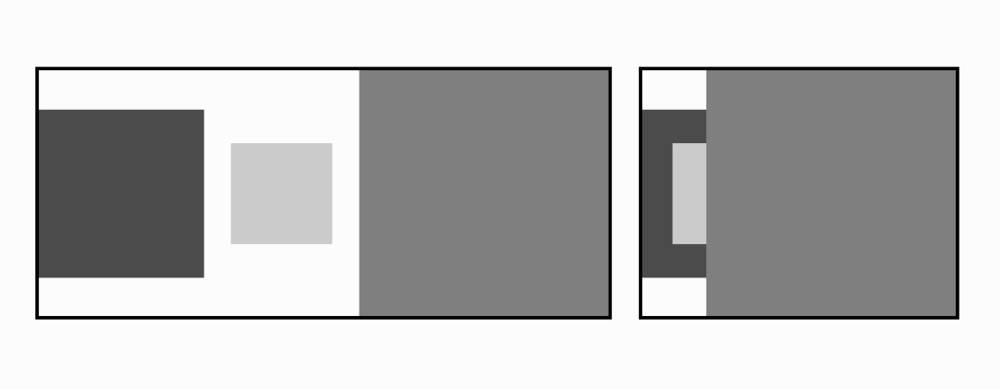
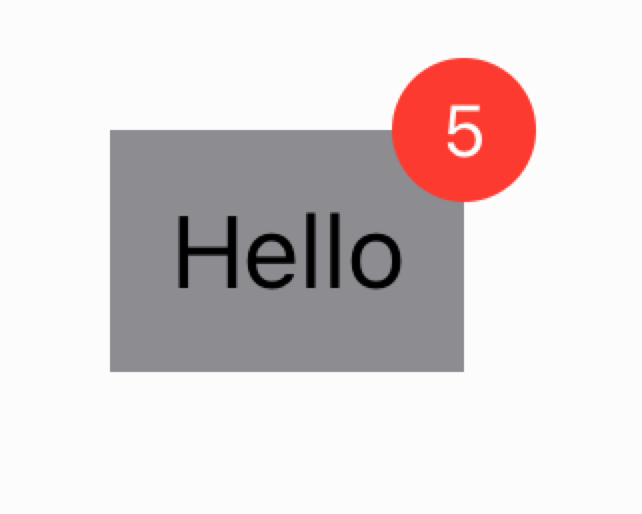

# Exercises 

## Collapsible HStack

Write a collapsible wrapper view around HStack. Here’s what the interface should look like:

```swift
struct Collapsible<Element, Content: View>: View {
    var data: [Element]
    var expanded: Bool = false
    var content: (Element) -> Content
    var body: some View { ... }
}
```
When expanded is true, the view should display just like a regular HStack, but when expanded is false, the items should be drawn on top of each other. The last item should be completely visible. Both states are in the following screenshot:

<div align="center">

</div>

When animating expanded from true to false, the items should animate between the two states. Note that we added a black border around the Collapsible view to show that the content should not be drawing out of bounds.

### Bonus Exercise

Make the Collapsible stack more configurable — especially the vertical alignment and the spacing.

## Badge View
Write a view extension that displays a badge at the top-right corner of a view without influencing the layout of the views around it. This is how the API should work:

```swift
struct ContentView: View {
    var body: some View {
        Text("Hello")
            .padding(10)
            .background(Color.gray)
            .badge(count: 5)
    }
}
```
<div align="center">

</div>

If count is 0, the badge should be hidden. Alternatively, the badge could take an optional Int and hide itself when count is nil.

### Bonus Exercises

- Ensure your badge works correctly in a right-to-left layout direction.
- Add configuration options for the position of the badge relative to the view (trailing or leading), the size and color, etc.